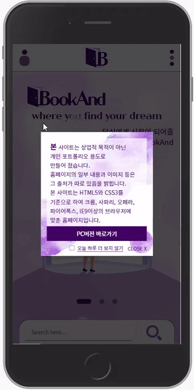

# BookAnd Rebranding Project - Mobile(2021. 02. 01 - 2021. 02. 15)

*sample view*

## Link

    http://mbookand.dothome.co.kr/

## Generated by

- HTML5
- CSS3
- jQuery / JS

## Goals

- to create a mobile website including 19 web-pages by using HTML, CSS, jQuery/JS
- to redirect to this mobile website using userAgent attribute of BOM navigator (when users have a PC website link on their mobile devices)
- to set pop-up window using setCookie in JS
- to apply swiper plug-in to main & product sliders
- to prevent event bubbling on click events on the menu panel and login icon
- to use substr method in jQuery/JS for book of month section preview
- to control videos with the self created play button of the website
